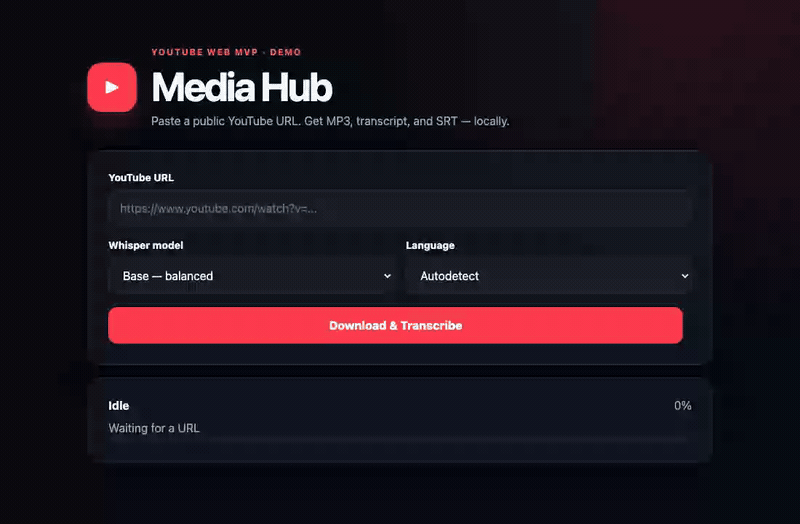

# Media Hub

[](https://github.com/ideiasfactory/media-hub/actions/workflows/ci.yml)
[](CHANGELOG.md)
[](https://www.python.org/downloads/)
[](LICENSE)
[](https://github.com/ideiasfactory/media-hub/commits/main)
[](https://github.com/ideiasfactory/media-hub/issues)
[](http://localhost:8010/docs)
[](docs/README.md)

**Paste a public YouTube URL. Get MP3, transcript, and SRT — on your machine.**

Local web MVP: download public YouTube audio, transcribe with Whisper, and download
MP3 / TXT / SRT / JSON. Modular monorepo, one Uvicorn process:
`frontend/` · `bff/` · `backend/` · `app/`.



| | |
|---|---|
| UI | [http://localhost:8010](http://localhost:8010) |
| Release notes | [http://localhost:8010/changelog](http://localhost:8010/changelog) |
| Swagger | [http://localhost:8010/docs](http://localhost:8010/docs) |
| Changelog | [CHANGELOG.md](CHANGELOG.md) |
| Architecture (technical) | [docs/ARCHITECTURE.md](docs/ARCHITECTURE.md) |
| Product / ADRs | [docs/](docs/README.md) |

## Adapters

| Source | Status | Epic |
|--------|--------|------|
| YouTube (single public video) | Done | EPIC-001 / 002 / 039 |
| Instagram | Planned | EPIC-005 |
| TikTok | Planned | EPIC-006 |
| Facebook / LinkedIn / Vimeo / Twitch | Planned | EPIC-007–010 |
| Podcasts / documents / images | Planned | EPIC-011–013 |

Propose a new source: [docs/ADAPTERS.md](docs/ADAPTERS.md).

## When to use Media Hub vs yt-dlp + Whisper CLI

| Use Media Hub when… | Prefer CLI scripts when… |
|---------------------|--------------------------|
| You want a local UI + `/api/v1` jobs | You only need a one-off shell pipeline |
| You need registry reuse + resume after failure | You already automate with your own scripts |
| You want TXT/SRT/JSON artifacts ready for RAG | You do not need HTTP, cancel, or release notes |

Media Hub wraps yt-dlp, FFmpeg and faster-whisper — it does **not** bypass DRM,
login, cookies, or geo blocks. See [DISCLAIMER.md](DISCLAIMER.md).

---

## Português

**Cole uma URL pública do YouTube. Saia com MP3, transcrição e SRT — na sua máquina.**

MVP web local para baixar áudio de vídeos públicos, transcrever com Whisper e
baixar MP3 / TXT / SRT / JSON. Monorepo modular (um processo).

### Adapters

| Fonte | Status | Épico |
|-------|--------|-------|
| YouTube (vídeo público individual) | Pronto | EPIC-001 / 002 / 039 |
| Instagram / TikTok / demais | Planejado | EPIC-005+ |

Como propor um adapter: [docs/ADAPTERS.md](docs/ADAPTERS.md).

### Quando usar o Media Hub

Prefira o Hub se quiser UI + API de jobs, reuso via registry e retomada após
falha. Prefira scripts `yt-dlp` + Whisper se precisar só de um pipeline one-shot
no terminal.

---

## Requirements

- Python 3.11+;
- FFmpeg on `PATH`;
- Network for video fetch and first Whisper model download;
- CPU / disk suitable for the chosen model.

### Install FFmpeg

macOS (Homebrew):

```bash
brew install ffmpeg
```

Ubuntu/Debian:

```bash
sudo apt update && sudo apt install ffmpeg
```

```bash
ffmpeg -version
```

## Install

```bash
git clone https://github.com/ideiasfactory/media-hub.git
cd media-hub
git switch main
python3.11 -m venv .venv
source .venv/bin/activate
python -m pip install --upgrade pip
python -m pip install -r requirements.txt
cp .env.example .env
```

Optional API protection in `.env`:

```bash
MEDIA_HUB_API_KEY=change-me
```

## Run

```bash
uvicorn app.main:app --host 0.0.0.0 --port 8010 --reload
```

### Docker (DEV — EPIC-036)

```bash
cp .env.example .env
mkdir -p logs output
touch registry.jsonl
docker compose up --build
```

CI/CD (self-host + GHCR): [docs/CICD.md](docs/CICD.md).  
Open core / ops / cloud: [docs/OPEN_CORE_AND_OPS.md](docs/OPEN_CORE_AND_OPS.md) ·
[docs/REPO_SEGMENTATION.md](docs/REPO_SEGMENTATION.md).

Open [http://localhost:8010](http://localhost:8010), paste a public single-video
URL, pick model/language, then **Baixar e Transcrever**.

## API

Contract: **`/api/v1`** (app SemVer in `/health` → `version`).

- `GET /`, `GET /changelog`, `GET /health`, `GET /docs`, `GET /redoc`
- `POST /api/v1/jobs` (`force` optional — skip registry / restart checkpoint)
- `GET /api/v1/jobs/{job_id}`
- `POST /api/v1/jobs/{job_id}/cancel`
- `GET /api/v1/jobs/{job_id}/files/{filename}`

With `MEDIA_HUB_API_KEY`, send `X-API-Key` (or `Authorization: Bearer <key>`).
Same-origin UI uses an HttpOnly cookie.

```bash
curl -X POST http://localhost:8010/api/v1/jobs \
  -H 'Content-Type: application/json' \
  -H 'X-API-Key: change-me' \
  -d '{"url":"https://www.youtube.com/watch?v=VIDEO_ID","model":"base","language":"autodetect"}'
```

Breaking API changes use a new path (`/api/v2`) — [ADR-017](docs/DECISIONS.md).

## Tests

```bash
pytest
python -m compileall app backend bff frontend
```

Lint / security (same as CI):

```bash
python -m pip install -r requirements-dev.txt
ruff check app backend bff frontend tests
ruff format --check app backend bff frontend tests
bandit -r app backend bff -ll -c pyproject.toml
pip-audit
```

## Generated files

Per job: `output/{job_id}/` (mirror) and stable cache under
`output/by-content/{content_hash}/`:

- `audio.mp3`, `transcript.txt`, `transcript.srt`, `metadata.json`

Dedup / resume: `registry.jsonl` (gitignored) keyed by
`SHA256(canonical YouTube URL)`.  
Logs: `logs/media-hub-YYYY-MM-DD.log` + monthly `logs/archive/yyyy-mm.tar.gz`
(30-day retention).

## Known limitations

- jobs live in memory only (lost on restart);
- single Uvicorn process; workers do not share job state;
- `output/` is not auto-cleaned;
- no queue / concurrency limits;
- Whisper models download on first use;
- private / restricted / unavailable videos may fail;
- single YouTube videos only (no playlists yet);
- cancel stops between pipeline steps (does not kill mid FFmpeg/Whisper call);
- production deploy pipeline is not active yet; IHL homolog CD lives in the
  private `media-hub-ops` repo (see [docs/CICD.md](docs/CICD.md)).

## Troubleshooting

- **FFmpeg missing:** install and run `ffmpeg -version`.
- **Slow first run:** model download — check network and disk.
- **Job fails:** URL must be public and login-free; update `yt-dlp` if YouTube changes.
- **Job vanished:** restart clears in-memory jobs; submit again (registry may resume).
- **401:** set/send `MEDIA_HUB_API_KEY` or leave it empty for open local mode.

## Contributing

See [CONTRIBUTING.md](CONTRIBUTING.md), [CODE_OF_CONDUCT.md](CODE_OF_CONDUCT.md),
and [docs/ADAPTERS.md](docs/ADAPTERS.md).

## License

[Apache License 2.0](LICENSE).

- Use, modification, and redistribution (including commercial) under Apache-2.0.
- Contributions are accepted under the same license.
- [DISCLAIMER.md](DISCLAIMER.md) still governs **third-party content** (copyright,
  illegal use, DRM).

## Responsible use

Process only content you own, are authorized to process, or that is otherwise
lawful. Illegal use is prohibited — including child sexual exploitation and other
crimes listed in the disclaimer. This project does not circumvent DRM, auth, geo
blocks, or other access controls and does not use platform cookies/credentials.

Read the [Disclaimer](DISCLAIMER.md) and [Privacy Policy](PRIVACY.md).
